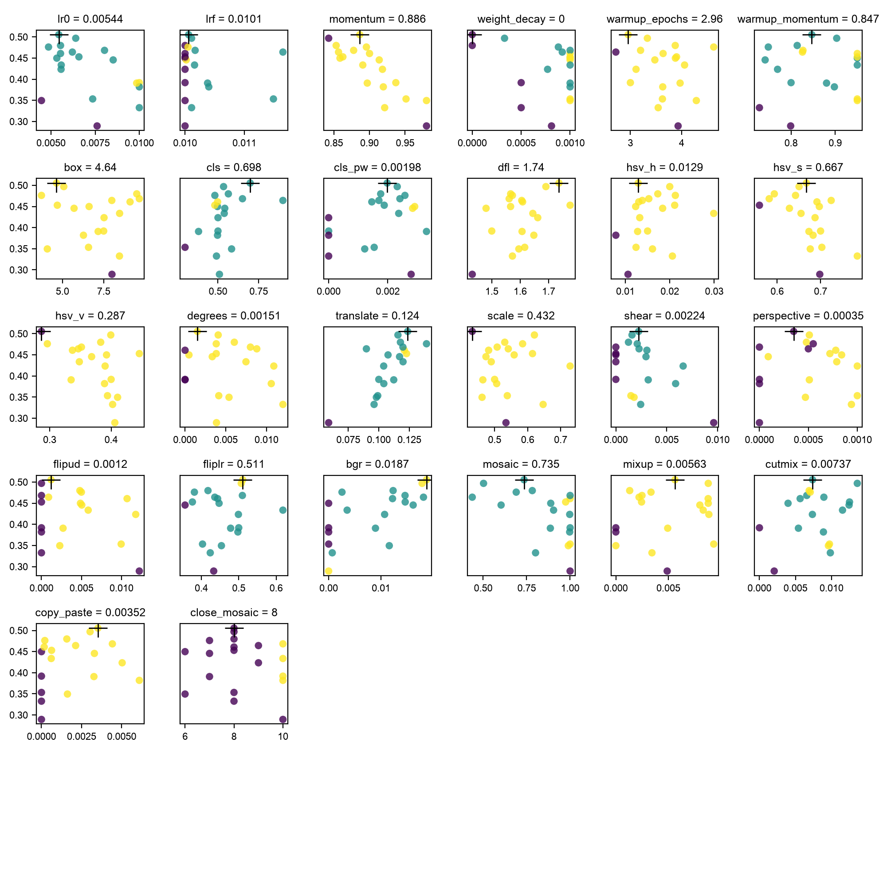

# Evolving an Object Detector with a Genetic Algorithm

**Neural Networks & Genetic Algorithms — course work (variant *with synergism*)**

A genetic algorithm tunes a YOLO object-detection network on COCO

---

## The task

- **Object detection:** given an everyday image, find *what* objects are present
  **and** *where* (bounding boxes).
- The neural network is **YOLO26n** — the one-stage detector from my Deep
  Learning project.
- **The new goal here:** don't hand-pick the network's hyperparameters —
  let a **genetic algorithm evolve them**, scored by the network's own accuracy.
- That coupling is the **synergism** this course asks for.

---

## The data — what it looks like

- **COCO** — Common Objects in Context. 80 classes, everyday scenes — 🔗 <https://cocodataset.org>
- **Traffic-cone** (real on-device run) — single class, not in COCO's 80 — 🔗 [dataset](https://github.com/krisstern/traffic-cone-image-dataset)
- From my EDA of COCO val2017 (4 952 images, 36 781 boxes):
  - **Severe imbalance** — person 11 004 vs toaster 9 (~1 200:1).
  - **Cluttered** — 7.4 objects per image on average (up to 63).
  - **Small-object-heavy** — 46.7 % of objects cover < 1 % of the image.

---

## The data — transformations & conclusions

**Transformations / preliminary analysis:**

- Dropped **crowd** boxes and degenerate (≤1 px) boxes.
- Images scaled to [0, 1]; standard YOLO augmentation (HSV, flip, mosaic…).

**Conclusions:**

- Because the data is **imbalanced and small-object-heavy**, hyperparameters
  like **learning rate** and **augmentation strength** strongly affect accuracy.
- They are worth **searching automatically**, not guessing — motivating the GA.

---

## How I solve it — the network

| | |
|--|--|
| Network | **YOLO26n** — one-stage, anchor-free; ~2.4 M params |
| Optimizer | AdamW, COCO-pretrained init |
| Evolved | ~20 hyperparameters = one **genome** (high-leverage genes below) |

- `lr0` / `lrf` — learning-rate start & final-factor (the LR schedule).
- `box` / `cls` / `dfl` — the three detection-loss weights; the GA's win came from **rebalancing these**.
- `momentum`, `weight_decay`, `warmup_*` — optimizer dynamics.
- `hsv_*`, `translate`, `scale`, `mosaic`, `mixup` — augmentation strengths.

**Backprop trains the weights; the GA tunes these knobs above it.**

---

## The synergism — a GA tunes the network

**The loop (one iteration = one generation):**

1. **Selection** — fitness-proportional pick from the top-9 genomes so far.
2. **Crossover** — blend the selected parents' genes (BLX-α).
3. **Mutation** — Gaussian perturbation of ~50 % of genes, then clip to range.
4. **Evaluation** — *train the YOLO network* with that genome, *measure mAP*.
5. **Record & repeat** — keep the best-so-far genome.

**Fitness = mAP@0.5:0.95**  (Ultralytics default weights `[0, 0, 0, 1]`)

> The GA can't score a genome without running the network; the network's
> hyperparameters come from the GA. **Neither works alone — that's the synergism.**

---

## Why a GA — and not gradient descent?

- Backprop trains the network's **weights** (~2.4 M) from the **gradient of the
  loss** — it runs inside every training step.
- But the **hyperparameters** (LR, loss weights, augmentation) govern *how* that
  training runs, and **validation mAP is non-differentiable** — it only exists
  *after* a full training run. You can't backprop through "train 10 epochs, then
  measure mAP."
- So gradient descent **can't** tune these knobs — but a **GA can**, by trial and
  error: try a setting, train, measure mAP, keep what works.
- The two are **nested**: the GA (outer loop) picks the settings; backprop (inner
  loop) trains the network with them. *That coupling is the synergism.*

---

## The synergism — settings & conditions

| Setting | Smoke demo | Real run (on-device) | Larger run (GPU) |
|--|--|--|--|
| Generations | 8 | 20 | 100 |
| Epochs / individual | 3 | 10 | 30 |
| Dataset | coco8 (8 imgs) | traffic-cone (1 class) | COCO 10-class subset |
| Mutation prob. | 0.5 | 0.5 | 0.5 |
| Selection | weighted top-9 | weighted top-9 | weighted top-9 |
| Device | Apple MPS | **Apple M3 (MPS)** | CUDA GPU |
| Seed | 42 | 42 | 42 |

Tool: Ultralytics' built-in evolutionary tuner (`YOLO.tune`) — a steady-state
genetic algorithm (selection + BLX-α crossover + mutation).

---

## Results — the GA converging

- **Traffic-cone run** (20 gens × 10 epochs, Apple M3, ~77 min): best-so-far **0.392 → 0.505** (peak gen 16) → **mAP@.5 ≈ 0.78, mAP@.5:.95 ≈ 0.505** — on the laptop, no GPU.
- Winning genome **rebalanced the loss** (box ↓, cls ↑, dfl ↑) → `best_hyperparameters.yaml`.
- **coco8 smoke run**: same loop in seconds (best 0.0308).

---

## Results — what the search learned

- Fitness vs each gene shows **which hyperparameters matter**.
- The **loss-weight genes** (`box`, `cls`, `dfl`) and **learning rate** are the high-leverage ones — the GA's win came from rebalancing them.
- The GA replaces manual trial-and-error with an **accuracy-driven search**.

---

## Scope & honest limitations

- The coco8 run is a **smoke demo** (8 gens × 3 epochs on **8 images**): it proves the **mechanism**, not a converged search — fitness stays near-zero by design.
- The **real result** is the traffic-cone run (single class), evolved **entirely on the M3 laptop** to **mAP@.5:.95 ≈ 0.505** (best of 20 generations).
- Genomes are scored at a **fixed budget** (10 epochs each): the winner is best *for that budget*, **not guaranteed optimal for a longer run** — a strong recipe to verify, not a proven optimum.
- The COCO-subset run (100 generations) is the *identical* command on a GPU.

---

## Technological description

- **Environment:** Python 3.13.7, managed with `uv`; VS Code.
- **Library stack:** Ultralytics (YOLO26 + genetic tuner), PyTorch /
  torchvision, pycocotools, matplotlib. Reuses my `objdetect` package for
  config, seed, and the class subset.
- **Hardware:** a **MacBook Air M3** (10-core GPU, MPS) runs both the smoke demo
  and the real traffic-cone evolution on-device — the same laptop that fine-tuned
  the cone detector in ~32 min.

---

## Summary

- Coupled a **genetic algorithm** with an **object-detection network** into a
  real synergism: **GA proposes hyperparameters → network scores them by mAP →
  GA selects & mutates toward better ones.**
- A **real on-device run** (traffic-cone, Apple M3) evolved the detector to
  **mAP@.5:.95 ≈ 0.505** in 20 generations — no GPU needed.
- End-to-end and reproducible from two `uv run` commands.
- Built on top of my Deep Learning project — data, EDA, and YOLO network reused;
  the new, graded contribution is the **evolutionary hyperparameter search**.
