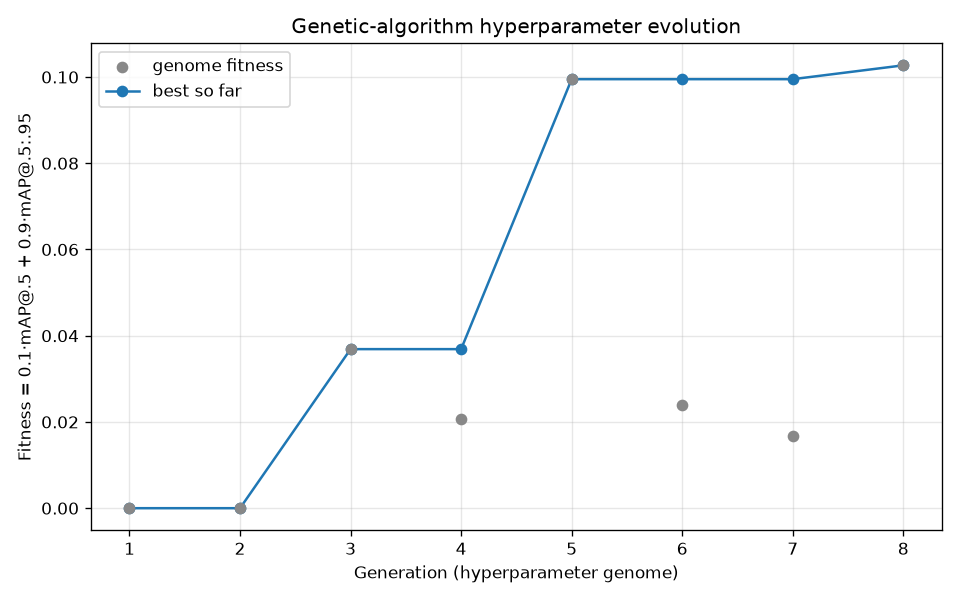

# GA × NN Synergism Report — Evolving a YOLO Detector's Hyperparameters

**Course:** Neural Networks & Genetic Algorithms — variant *"със синергизъм"* (with synergism). **Author:** Borislav Valkov.

A **genetic algorithm optimizes a YOLO detector's hyperparameters**, scored by the network's own validation mAP. The neural network, COCO data, and EDA are reused from the Deep Learning project (Topic 4); the new contribution is the evolutionary search.

> Reproduce (smoke demo, then the real on-device run):
> ```bash
> uv run python _NNGA/src/evolve_hyperparameters.py --data coco8.yaml --epochs 3 --iterations 8
> uv run python _NNGA/src/evolve_hyperparameters.py \
>     --data DATA/traffic_cone/traffic_cone.yaml --epochs 10 --iterations 20 --device mps
> ```

## 1. The task

Object detection: given an image, predict *what* objects are present and *where* (boxes). The network is **YOLO26n** (Ultralytics), benchmarked in the DL project (mAP@.5:.95 ≈ 0.47, ~57 FPS, 2.4 M params). Here it is the *substrate*; the contribution is how its hyperparameters are chosen.

## 2. The data

- **COCO** (link: <https://cocodataset.org>) — 80 classes; the EDA shows severe imbalance (person 11 004 vs toaster 9), 7.4 objects/image, and 46.7 % of objects under 1 % of image area: a cluttered, small-object benchmark. Crowd and ≤1 px boxes dropped, images scaled to [0,1].
- **Traffic-cone** (link: <https://github.com/krisstern/traffic-cone-image-dataset>) — a single-class set small enough to evolve **entirely on the laptop (Apple M3, no GPU)**; the defensible "real" target.
- **Conclusion:** because imbalance and small objects dominate, learning rate and augmentation strength strongly affect accuracy — worth evolving, not guessing.

## 3. The neural network

| | Value |
|--|--|
| Architecture | YOLO26n — one-stage, anchor-free |
| Parameters | ~2.4 M |
| Optimizer | AdamW |
| Init | COCO-pretrained, fine-tuned per GA individual |
| Fixed | seed = 42, epochs per individual |

## 4. The synergism — a GA tunes the network

Ultralytics' built-in evolutionary tuner (`YOLO.tune`) is a **steady-state genetic algorithm** over hyperparameter *genomes* — ~20 genes: `lr0`, `lrf`, momentum, weight decay, warmup, box/cls/dfl loss weights, and augmentation strengths.

**Fitness** = the network's validation **mAP@0.5:0.95** (this release weights `[0, 0, 0, 1]` over `[P, R, mAP@0.5, mAP@0.5:0.95]`). The GA cannot score a genome without training the network, and the network's hyperparameters come from the GA — neither works alone.

**The GA loop** (one iteration = one generation):

1. **Selection** — fitness-proportional pick from the top-9 genomes so far.
2. **Crossover** — BLX-α blend of the selected parents' genes.
3. **Mutation** — Gaussian perturbation of ~50 % of genes, then clip to range.
4. **Evaluation** — train YOLO with the genome, measure mAP.
5. **Record & repeat** — keep the best-so-far in `best_hyperparameters.yaml`.

(A genuine three-operator GA — selection + crossover + mutation — verified in `ultralytics/engine/tuner.py`, v8.4.66.)

| Setting | Smoke demo | Real run | Larger run (GPU) |
|--|--|--|--|
| Generations | 8 | 20 | 100 |
| Epochs / individual | 3 | 10 | 30 |
| Dataset | coco8 | traffic-cone | COCO 10-class |
| Device | MPS | Apple M3 (MPS) | CUDA GPU |
| Seed | 42 | 42 | 42 |

## 5. Results

Real on-device run (traffic-cone, 20 generations × 10 epochs, Apple M3, ~77 min):



- Best-so-far climbs **0.392 → 0.505** (peak at generation 16), then holds — **mAP@.5 ≈ 0.78, mAP@.5:.95 ≈ 0.505**, a good single-class detector found by evolution. Individual generations bounce (gen 10 → 0.167): mutation exploring, selection keeping the best.
- The winning genome **rebalanced the detection loss** (box ↓ 4.64, cls ↑ 0.70, dfl ↑ 1.74, lower `lr0`, gentler mosaic) — weighting classification/box-quality over box loss for this easy class. Saved to `best_hyperparameters.yaml`.
- The **coco8 smoke run** (8 gens, best 0.0308) proves the same loop in seconds — near-zero by design (3 epochs on 8 images).

> **Honest scope.** Genomes are scored at a fixed short budget (10 epochs), so the winner is best *for that budget*, not guaranteed optimal for a longer run — treat the result as a strong recipe to verify, not a proven global optimum.

## 6. Why a GA (vs. the DL project's manual tuning)

The DL project set the LR *schedule* by hand; the GA answers the complementary question — *which* hyperparameters to pick in the first place — by automated, accuracy-driven search rather than intuition.

## 7. Technological description

- **Environment:** Python 3.13.7, managed with `uv`; VS Code.
- **Stack:** Ultralytics (YOLO26 + genetic tuner), PyTorch/torchvision, pycocotools, matplotlib; reuses the `objdetect` package for config/seed.
- **Hardware:** a MacBook Air M3 runs both the smoke demo and the real cone evolution on-device (MPS); a CUDA GPU (~\$20) is only needed for the larger COCO-subset run.

## 8. Conclusions

- A GA and an object-detection network were coupled into a real synergism: the GA proposes hyperparameter genomes, the network scores them by validation mAP, the GA selects and mutates toward better ones.
- On a real on-device run the search reached **mAP@.5:.95 ≈ 0.505** by rebalancing the detection-loss weights — reproducible from two `uv run` commands.
- The fitness signal *is* the network's accuracy, so the two components are inseparable.
