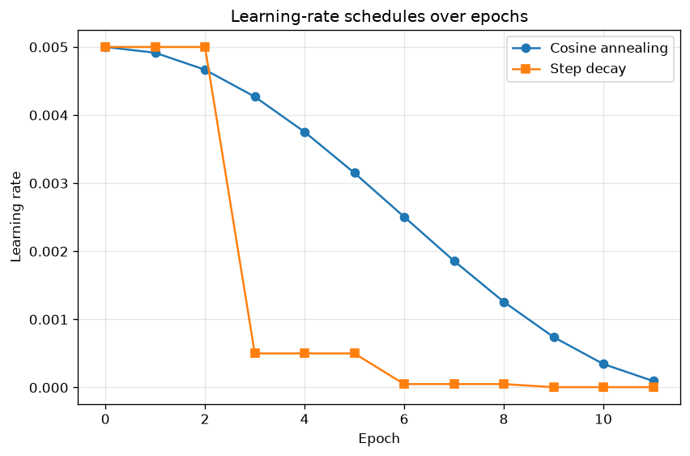
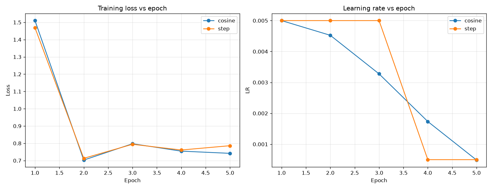

# Model Report — Object Detection on COCO

This is the project's **model report file** (a stated success criterion). It
records every experiment as a hypothesis: the dataset slice, the configuration,
the metrics, and the conclusions, so the results are reproducible and
presentable.

> How to regenerate everything in this report:
> ```bash
> uv run python scripts/download_data.py            # COCO val2017
> uv run python scripts/run_eda.py                  # EDA figures + summary
> uv run python scripts/plot_lr_schedules.py        # LR schedule figure
> uv run python scripts/benchmark_baselines.py      # baseline comparison table (§4)
> uv run python scripts/run_experiments.py          # fine-tune + LR comparison (§6)
> # Extension — custom traffic-cone class (§7):
> git clone --depth 1 https://github.com/krisstern/traffic-cone-image-dataset.git DATA/_cone_src
> uv run python scripts/prepare_cone_dataset.py      # seeded 80/20 split + data yaml
 # absolute project path -> run lands in DATA/runs/ (a relative path nests under
> # Ultralytics' default runs/detect/, so pass it absolute); run from repo root:
> uv run yolo detect train model=yolo26n.pt data=DATA/traffic_cone/traffic_cone.yaml \
>   epochs=100 imgsz=640 batch=16 device=mps cache=disk patience=30 \
>   project="$PWD/DATA/runs" name=cone_yolo26n
> # publish best weights to the path the app loads (config.CHECKPOINTS_DIR):
> cp DATA/runs/cone_yolo26n/weights/best.pt DATA/checkpoints/cone_yolo26n.pt
> ```

## How this report follows the Model-Report-File (MRF) guidelines

The MRF spec (`Documentation/_MRF Requirements.md`) describes an Excel artifact
where *each row is a hypothesis*, columns are *hyperparameters then ≤3 test-set
metrics* with *% change vs a baseline row*, a *`Comments`* column, an explicit
*best-model* statement, and *train-vs-validation* diagrams. This report keeps
that structure in Markdown (the project's chosen format). Two MRF rules are
adapted, and both adaptations are flagged where they occur:

- **Baseline (MRF rule 3).** The MRF baseline is "the deployed model, else the
  greediest statistical model (e.g. predict the most common class)." Object
  detection has no meaningful most-common-class predictor (a no-prediction model
  scores mAP ≈ 0, making every % change infinite and useless). The realistic
  baseline a client starts from is the **off-the-shelf COCO-pretrained
  Faster R-CNN**, so that is row 1 and all % changes are measured against it.
- **Train-vs-validation diagrams (MRF rule 7).** The smoke runs log per-epoch
  *training* loss and only end-of-run mAP, so a true per-epoch train-vs-val curve
  is deferred to the full cloud run; see the honesty note in §6.

## 1. Dataset

- **Source:** COCO 2017 validation split (5 000 images), the everyday-context
  benchmark named in the assignment.
- **Subset for fine-tuning** (`config.SUBSET_CLASSES`): person, bicycle, car,
  dog, cat, chair, bottle, cup, laptop, cell phone — ten common classes kept
  small so experiments fit the time and cloud budget.
- **Preprocessing:** crowd boxes and degenerate (≤1 px) boxes dropped; images
  scaled to float tensors in [0, 1]; horizontal-flip augmentation for training.
- See `EDA_REPORT.md` for the full data analysis (Requirement 2).

## 2. Models compared

| Model | Family | Backbone | Params | Source |
|-------|--------|----------|:------:|--------|
| Faster R-CNN | Two-stage | ResNet-50 + FPN | 41.8 M | torchvision, COCO-pretrained |
| YOLO26n | One-stage | anchor-free | 2.4 M | Ultralytics (YOLO26), COCO-pretrained |

Both start from COCO-pretrained weights. The pretrained models are evaluated as
the baseline comparison (§4); Faster R-CNN is additionally fine-tuned to
demonstrate the training pipeline and the LR-schedule experiment (§6).

Parameter count is treated as a fixed *model attribute* (above), not one of the
≤3 metrics, to honour the MRF's metric cap while preserving the size story.

## 3. Metrics (≤3, on the evaluation set)

- **mAP@[.50:.95]** — COCO primary metric (averaged over 10 IoU thresholds).
- **mAP@.50** — the classic looser metric.
- **Inference speed (FPS)** — images/second on the evaluation device. Treat as
  relative, not a hardware-spec figure.

## 4. Hypothesis table — pretrained baselines (Requirements 3–4)

Measured by `scripts/benchmark_baselines.py` on 200 subset images (CPU/MPS),
through the shared `evaluate_coco_map` so both models go through one fair
evaluation path. Rows are in creation order; **row 1 (Faster R-CNN) is the
baseline**, and each metric shows its value with **% change vs that baseline**.
Bold marks the best value in each metric column.

| # | Model (hyperparameters) | mAP@[.50:.95] | mAP@.50 | FPS (img/s) | Comments |
|---|-------------------------|:-------------:|:-------:|:-----------:|----------|
| 1 | **Faster R-CNN** — two-stage, ResNet-50+FPN, 41.8 M (baseline) | 0.467 | **0.699** | 3.2 | Baseline. Strongest at loose IoU — its "propose then refine" design + FPN recalls more objects. Slow and large. |
| 2 | **YOLO26n** — one-stage, anchor-free, 2.4 M | **0.470** (+0.6%) | 0.622 (−11.0%) | **57.2** (+1670%) | Overall mAP essentially tied; ~18× faster and ~17× smaller. Loses recall at loose IoU but its fired boxes are precise. |

> **Best model: YOLO26n**, for this project's target (a Streamlit web app
> detecting objects in everyday images). Overall accuracy is tied with the
> baseline (+0.6% mAP@[.50:.95]) while it runs ~18× faster and is ~17× smaller —
> decisive for interactive, deployable inference. **Choose Faster R-CNN instead
> only if maximum recall at loose IoU is the priority** (it leads mAP@.50 by
> +12.4%), e.g. when missing objects is costlier than latency.

**Reading the table — the project's central result:**

- **Speed/size:** YOLO26n runs ~18× faster and is ~17× smaller — the one-stage
  vs two-stage trade-off in raw form.
- **Accuracy:** Faster R-CNN clearly wins at the *loose* IoU threshold
  (mAP@.50 0.70 vs 0.62) — it localizes and recalls objects more reliably.
- **The surprise worth discussing:** overall mAP@[.50:.95] is essentially *tied*
  (0.467 vs 0.470). Modern one-stage detectors have largely closed the accuracy
  gap; YOLO26's boxes are very precise when it fires, while Faster R-CNN's edge
  is catching more objects at moderate overlap.

This single table is the heart of the presentation: *which detector you pick
depends on whether you are bounded by accuracy/recall or by latency/size.*

## 5. Fine-tuning pipeline

The fine-tuning pipeline (`scripts/train.py`, `scripts/run_experiments.py`) was
validated end-to-end on the subset: training loss decreases and checkpoints and
history are saved. Example smoke run (Faster R-CNN, cosine schedule, CPU):

```
epoch 1/3  lr=0.00500  loss=1.4337
epoch 2/3  lr=0.00375  loss=0.9316
epoch 3/3  lr=0.00126  loss=0.9344
```

The smoke configuration (few epochs, capped batches) exists to prove the
pipeline on a laptop. A full fine-tune (all subset images, ~10–15 epochs) is
intended for a CUDA GPU instance (AWS g5.xlarge) and is launched with the same
script minus `--max-batches`; see the LR-schedule experiment below, which uses
this pipeline.

## 6. Hypothesis table — LR-schedule experiment (Requirement 5)

Two Faster R-CNN fine-tuning runs, **identical except for the LR schedule**
(same seed, epochs, base LR, data), produced by `scripts/run_experiments.py`.
This is a self-contained sub-experiment with its own consistent eval slice
(~50 images), so % change is measured **within the experiment, vs the
cosine run (row 1, created first)**.

**The schedules themselves** (`scripts/plot_lr_schedules.py`):



- **Step decay** holds the LR flat, then multiplies it by 0.1 every few epochs —
  a staircase.
- **Cosine annealing** glides the LR down a half-cosine from the base value to a
  small floor — smooth, spending longer near the extremes.

**The actual runs** (5 epochs, capped batches — a demonstration, not a converged
model):



| # | Schedule (hyperparameters) | Final train loss | mAP@[.50:.95] | mAP@.50 | Comments |
|---|----------------------------|:----------------:|:-------------:|:-------:|----------|
| 1 | **Cosine annealing** — 5 ep, base LR 0.005 (baseline) | **0.742** | 0.092 | 0.168 | Baseline of the experiment. Smooth late-epoch decay let training keep settling → lowest final loss. LR: 0.0050→0.0045→0.0033→0.0017→0.0005. |
| 2 | **Step decay** — 5 ep, base LR 0.005 | 0.786 (+5.9%, worse) | **0.096** (+4.3%) | **0.180** (+7.0%) | Holds a high LR until its scheduled ×0.1 drop → higher final loss. mAP edges ahead, but within noise at this scale. LR: 0.0050→0.0050→0.0050→0.0005→0.0005. |

> **Best schedule (these runs): cosine annealing.** It reached the lowest final
> training loss (0.742 vs 0.786), the intended Requirement-5 takeaway. The mAP
> gap favouring step decay is within noise at this demonstration scale (~0.09 mAP
> on 50 images) and is not a reliable signal.

**What the experiment shows:**

- The **LR-vs-epoch curves clearly differ** — smooth cosine glide vs step
  staircase — which is exactly what Requirement 5 asks to demonstrate.
- Both runs converge quickly from the pretrained init (loss drops ~1.5 → ~0.75
  within one epoch).
- Cosine reached a slightly lower final loss; step decay holds a comparatively
  high LR until its scheduled drop.

> **Honesty note for the defense (MRF rule 7).** These are deliberately *small*
> runs (≈100 training images per run, evaluated on ~50), so the absolute mAP
> (~0.09) is far below the pretrained baseline in §4 — they exist to demonstrate
> the schedule *mechanism* on a laptop, not to beat the baseline. The smoke runs
> log per-epoch *training* loss and only end-of-run mAP, so the MRF's
> *train-vs-validation* loss/metric curves are produced by the full cloud run
> (all subset images, 10–15 epochs, identical command without `--max-batches`),
> which records both splits per epoch. The LR-vs-epoch and training-loss-vs-epoch
> curves above are shown in the interim.

## 7. Extension — fine-tuning a new class (traffic cone)

**Hypothesis:** YOLO26n can be extended to a class **outside COCO's 80** by
fine-tuning on a small, single-class dataset, yielding a deployable third model
for the app without retraining on COCO.

- **Dataset:** [krisstern/traffic-cone-image-dataset](https://github.com/krisstern/traffic-cone-image-dataset)
  — 263 images, single class `traffic cone`, YOLO-format labels, no known
  copyright. Laid out by `scripts/prepare_cone_dataset.py` into a reproducible,
  seeded (SEED=42) **80/20 split: 210 train / 53 val**.
- **Config:** fine-tune from `yolo26n.pt`, 100 epochs, imgsz 640, batch 16,
  optimizer `auto` (AdamW, lr≈0.002), `patience=30`, `device=mps`.
- **Hardware:** local Apple Silicon — MacBook Air **M3** (10-core GPU, 16 GB).
  Full run completed in **~32 min** (≈26 s/epoch), comfortably on-device.

| # | Model (hyperparameters) | Precision | Recall | mAP@.50 | mAP@[.50:.95] | Comments |
|---|-------------------------|:---------:|:------:|:-------:|:-------------:|----------|
| 1 | **Cone YOLO26n** — fine-tuned, 1 class, 100 ep, 210 train imgs | 0.919 | 0.837 | 0.898 | 0.660 | Strong for a tiny single-class set; an easy, visually distinct class converges fast. Metrics on the held-out 53-image val split. |

> **Outcome:** single-class fine-tuning makes the model forget COCO's 80 classes
> (expected catastrophic forgetting), so the cone model is not deployed alone.
> Instead the app exposes a combined **"YOLO26n + Cones (81 classes)"** option
> (`EnsembleDetector`) that runs stock YOLO26n and the cone model together and
> concatenates their detections — covering all 81 classes in one pass.

**Honesty note for the defense.** This is a deliberately small, *easy* class on
263 images; the high mAP reflects how distinctive cones are, not a large-scale
result. The combined ensemble assumes disjoint classes (COCO vs. cone) and
applies no cross-model NMS, which is safe here because the class sets do not
overlap.

## 8. Conclusions

- **The accuracy/speed trade-off is real and measurable.** On the same COCO
  subset, YOLO26n is ~18× faster and ~17× smaller than Faster R-CNN, while
  Faster R-CNN is more reliable at loose IoU (mAP@.50 0.70 vs 0.62). Overall
  mAP@[.50:.95] is essentially tied — modern one-stage detectors have closed the
  historical accuracy gap.
- **Best model: YOLO26n** for the web-app target (tied accuracy, far faster and
  smaller); **Faster R-CNN** when maximum recall / small-object reliability
  outranks latency and size.
- **The training pipeline works end-to-end**, and the LR-schedule experiment
  demonstrates both required schedules, with cosine annealing edging out step
  decay on final training loss in these runs.
- **The model is extensible to new classes.** Fine-tuning YOLO26n on a small
  single-class set (traffic cone, not in COCO) reached mAP@.50 0.898 on-device
  in ~32 min, and ships as a third app model plus a combined 81-class ensemble
  (§7).
- **Everything is reproducible** from the commands at the top of this report and
  is covered by an automated test suite (exercise-style unit tests + BDD).
