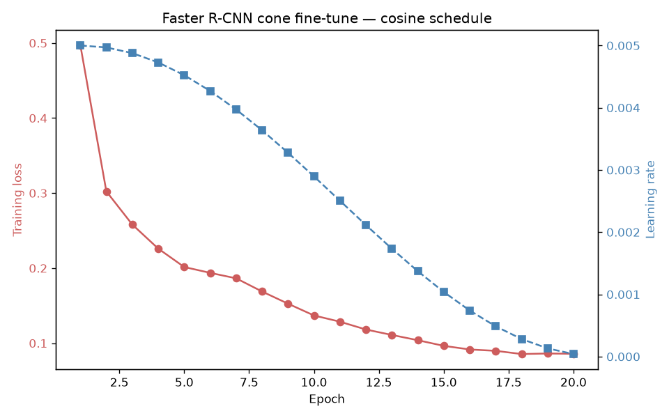
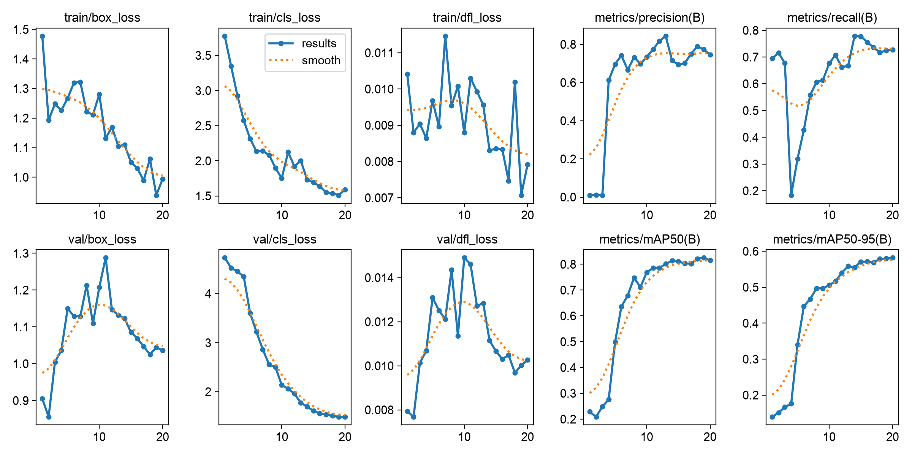

# Model Report — Object Detection on COCO

## 1. Data

- **COCO 2017 val** (used in §3–4): 5 000 images; fine-tuning restricted to a 10-class everyday subset (`config.SUBSET_CLASSES`: person, bicycle, car, dog, cat, chair, bottle, cup, laptop, cell phone). Crowd and ≤1 px boxes dropped; horizontal-flip augmentation. Full analysis: `research/EDA_REPORT.md`.
- **Traffic-cone dataset** (used in §5): 263 images of a single class outside COCO's 80, for the extension experiment — source and train/val split in §5.

## 2. Models compared

| Model | Family | Backbone | Params | Source |
|-------|--------|----------|:------:|--------|
| Faster R-CNN | Two-stage | ResNet-50 + FPN | 41.8 M | torchvision, COCO-pretrained |
| YOLO26n | One-stage | anchor-free | 2.4 M | Ultralytics (YOLO26), COCO-pretrained |

**Metrics** (on the evaluation set):

- **mAP@[.50:.95]** — the COCO primary score.
- **mAP@.50** — a looser version.
- **Inference speed (FPS)** — frames per second, i.e. images processed per second; compared between the two models rather than as absolute hardware benchmarks.

## 3. Pretrained baselines

Measured by `benchmark_baselines` on 200 subset images through the shared `evaluate_coco_map`. Both rows use off-the-shelf COCO-pretrained weights; Faster R-CNN (the established two-stage detector) is the reference the YOLO percentages are measured against.

| # | Model (hyperparameters) | mAP@[.50:.95] | mAP@.50 | FPS (img/s) | Comments |
|---|-------------------------|:-------------:|:-------:|:-----------:|----------|
| 1 | **Faster R-CNN** — two-stage, ResNet-50+FPN, 41.8 M (baseline) | 0.467 | **0.699** | 3.2 | Baseline. Strongest at loose IoU — "propose then refine" + FPN recalls more objects. Slow and large. |
| 2 | **YOLO26n** — one-stage, anchor-free, 2.4 M | **0.470** (+0.6%) | 0.622 (−11.0%) | **57.2** (~18×) | Overall mAP tied; ~18× faster, ~17× smaller. Loses recall at loose IoU but its fired boxes are precise. |

> **Best model: YOLO26n** for this project's target (a Streamlit app on everyday images): accuracy tied with the baseline (+0.6% mAP@[.50:.95]) while ~18× faster and ~17× smaller — decisive for interactive inference. **Pick Faster R-CNN only if max recall at loose IoU is the priority** (it leads mAP@.50 by +12.4%).

## 4. Learning-rate schedule experiment

Two Faster R-CNN runs, **identical except for the learning-rate schedule** (`run_experiments`), both evaluated on the same ~50 images. The percentages in row 2 show how step decay compares to the cosine run in row 1 (the baseline).

Shared settings:

- base learning rate 0.005
- SGD (momentum 0.9, weight decay 5e-4)
- batch size 2
- seed 42
- a capped number of batches

This is a quick demonstration of the schedule *mechanism*, not a fully trained model — so the absolute mAP (~0.09) is far lower than the pretrained models in §3 (~0.47), as expected. The figures below show learning rate and training loss per epoch (no train-vs-validation split is logged).

| # | Schedule (hyperparameters) | Final train loss | mAP@[.50:.95] | mAP@.50 | Comments |
|---|----------------------------|:----------------:|:-------------:|:-------:|----------|
| 1 | **Cosine annealing** — `CosineAnnealingLR`, 5 ep, `eta_min=1e-5` (baseline) | **0.742** | 0.092 | 0.168 | Glides the LR down a half-cosine to a small floor; smooth late decay → lowest final loss. |
| 2 | **Step decay** — `StepLR`, 5 ep, `step_size=3`, `gamma=0.1` | 0.786 (+6.0%, worse) | **0.096** (+4.3%) | **0.180** (+7.0%) | Holds the LR flat, then ×0.1 every 3 epochs (staircase); higher loss, mAP edge within noise. |

> **Best schedule (these runs): cosine annealing** — lowest final training loss (0.742 vs 0.786). The mAP gap favouring step decay is within noise at this scale (~0.09 mAP on 50 images).

## 5. Extension — fine-tuning a new class (traffic cone)

**Hypothesis:** both detector families extend to a class **outside COCO's 80** by fine-tuning on a small single-class set — also giving a two-stage vs one-stage comparison on a custom class.

- **Dataset:** [krisstern/traffic-cone-image-dataset](https://github.com/krisstern/traffic-cone-image-dataset) — 263 images, single class, seeded (SEED=42) **80/20 split: 210 train / 53 val** (both models use the *same* split).
- **YOLO:** from `yolo26n.pt`, imgsz 640, batch 16, AdamW (lr≈0.002), `patience=30`, MPS. Trained at two budgets: **100 ep** (deployed, ~32 min) and **20 ep** (budget-matched to Faster R-CNN, ~6 min).
- **Faster R-CNN:** COCO-pretrained backbone + fresh 1-class head, 20 ep cosine, base LR 0.005, 512 px, CPU (training over-commits MPS memory). ~50 min on M3. Cone labels converted to COCO (`prepare_cone_coco`) so both score through the *same* `evaluate_coco_map`.

Three runs on the same 53-image val split. **Row 1 (Cone Faster R-CNN) is the baseline.** The recipes still differ beyond epochs (YOLO uses AdamW / 640 px / MPS, Faster R-CNN uses SGD / 512 px / CPU), so this is a best-effort comparison, not a fully controlled ablation.

| # | Model (hyperparameters) | mAP@[.50:.95] | mAP@.50 | Comments |
|---|-------------------------|:-------------:|:-------:|----------|
| 1 | **Cone Faster R-CNN** — two-stage, 1 class, 20 ep cosine, 210 train imgs (baseline) | 0.647 | 0.896 | Reference. Already strong at only 20 epochs; train loss 0.50→0.086. |
| 2 | **Cone YOLO26n** — one-stage, 1 class, 20 ep, 210 train imgs | 0.589 (−9.0%) | 0.829 (−7.5%) | Budget-matched: at 20 ep YOLO trails Faster R-CNN on both metrics. |
| 3 | **Cone YOLO26n** — one-stage, 1 class, **100 ep**, 210 train imgs (deployed) | **0.678** (+4.8%) | **0.917** (+2.3%) | Best result, but needs 5× the epochs to pass Faster R-CNN. |

> **Verdict: at an equal 20-epoch budget, the two-stage model wins.**
>
> - Equal budget (20 ep): Faster R-CNN **0.896 / 0.647** vs YOLO **0.829 / 0.589** (mAP@.50 / mAP@[.50:.95]).
> - YOLO passes it only at 100 ep (**0.917 / 0.678**) — ~5× the training.
> - So Faster R-CNN is the more epoch-efficient learner; YOLO's edge is its ceiling with more epochs plus speed/size, not faster convergence.
> - Caveat: easy, distinctive class on 263 images — the high mAP reflects the class, not a large-scale result.

## 6. Conclusions

- **The accuracy/speed trade-off is real and measurable:** YOLO26n is ~18× faster and ~17× smaller than Faster R-CNN; FRCNN is more reliable at loose IoU (mAP@.50 0.70 vs 0.62); overall mAP@[.50:.95] is essentially tied, as modern one-stage detectors have closed the historical accuracy gap.
- **Best model: YOLO26n** for the web-app target; **Faster R-CNN** when max recall outranks latency/size.
- **The LR-schedule experiment** demonstrates both required schedules, cosine edging out step decay on final training loss.
- **Both families extend to a new class, but the two-stage model is more epoch-efficient:** at an equal 20-epoch budget Faster R-CNN leads (mAP@.50 0.896 vs 0.829), and YOLO overtakes it only with ~5× the epochs (0.917 at 100 ep). Each family ships an 81-class "+ Cones" ensemble in the app.
