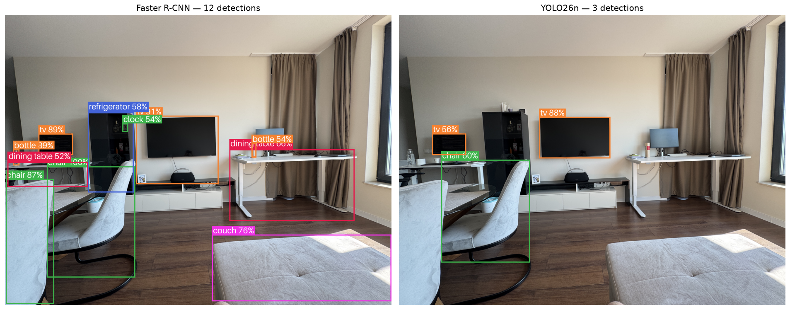

# Object Detection in Everyday Images

**Deep Learning course project — Topic 4**

Faster R-CNN vs YOLO on COCO, with a Streamlit web app

Borislav Valkov

> Render these slides with: `marp reports/PRESENTATION.md` (or open in the
> Marp VS Code extension). Figures are in `reports/figures/`.

---

## The problem

- **Object detection** = *what* objects are in an image **and** *where* (boxes).
- Harder than classification: unknown number of objects, many scales, clutter.
- **Goal:** a web app that detects everyday objects, backed by experiments with
  two detector families on the **COCO** dataset.

---

## Approach (the 7 required steps)

1. Literature review of detection techniques
2. Explore the COCO data
3. Experiment with **Faster R-CNN** (two-stage)
4. Experiment with **YOLO** (one-stage)
5. Demonstrate LR schedules: **cosine annealing** & **step decay**
6. **Streamlit** UI + tests
7. This presentation

Plus: **behaviour-driven development** and a **model report**.

---

## Two families of detectors

| | Two-stage (Faster R-CNN) | One-stage (YOLO) |
|--|--|--|
| Idea | propose regions, then classify | predict boxes directly from a grid |
| Strength | accuracy, small objects | speed, small size |
| Key parts | RPN, RoI heads, FPN | grid head, anchor-free |

The project compares the textbook representative of each — that comparison **is**
the story of the field.

---

## The data — COCO val2017

- **4 952 images, 36 781 annotations, 80 classes**
- We fine-tune on a **10-class everyday subset** (person, car, dog, cat, chair…)

Severe **imbalance**: person 11 004 instances vs toaster 9 (~1 200:1).

---

## The data — what makes it hard

 

- **7.4 objects/image** on average, up to 63 — cluttered scenes.
- **47% of objects are tiny** (<1% of image area) — the hardest case.
- Classes **co-occur** by context (cup ↔ dining table) — real dependencies.
- Anomalies (crowd / tiny / extreme boxes) are **filtered** before training.

---

## Results — the central table

| Model | mAP@.50:.95 | mAP@.50 | FPS | Params |
|--|:--:|:--:|:--:|:--:|
| Faster R-CNN | 0.467 | **0.699** | 3.2 | 41.8 M |
| YOLO26n | 0.470 | 0.622 | **57.2** | 2.4 M |

- YOLO: **~18× faster, ~17× smaller**.
- Faster R-CNN: **better at loose IoU** (more reliable recall).
- Overall mAP is **tied** — modern one-stage has closed the gap.

---

## Results — seeing the difference

Same image: Faster R-CNN fires on more objects (12 vs 3 at 0.5) — higher recall,
more false positives. The trade-off, made visible.

---

## Learning-rate schedules (Req. 5)

- **Step decay:** constant, then ÷10 every *k* epochs (a staircase).
- **Cosine annealing:** smooth half-cosine from base LR down to a floor.
- Both decay the LR as epochs grow → large early steps, fine late steps.

---

## The web app (Req. 6)

- **Streamlit**: upload a photo → pick model → confidence slider → boxes + table.
- Logic split from UI (`inference.py`) so it is **testable**.
- **Tests:**
  - exercise-style `unittest` (Arrange/Act/Assert) for data, schedulers,
    inference, visualization;
  - **BDD** with `pytest-bdd`: Gherkin scenarios for detecting & thresholding.
- `uv run pytest` → **all green**.

---

## What I'd do with more time / compute

- Longer fine-tune over all subset images, more epochs.
- Add a larger YOLO (v8m) and a RetinaNet for a three-way curve.
- Per-class mAP breakdown to see where each model wins.

---

## Summary

- Built an end-to-end detection project: **data → models → training → eval → app**.
- Quantified the **accuracy/speed trade-off** between two-stage and one-stage.
- Demonstrated **LR scheduling**, **BDD tests**, and a **model report**.
- Everything reproducible with a handful of `uv run` commands.

**Demo time →** `uv run streamlit run objdetect/app/main.py`
