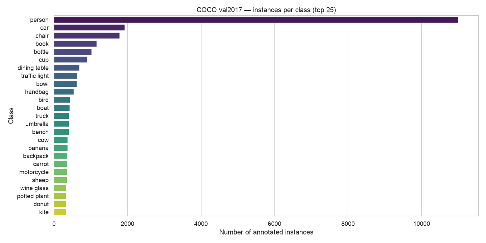
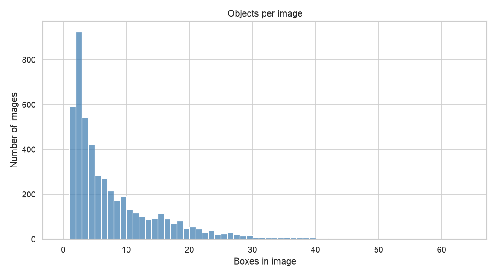
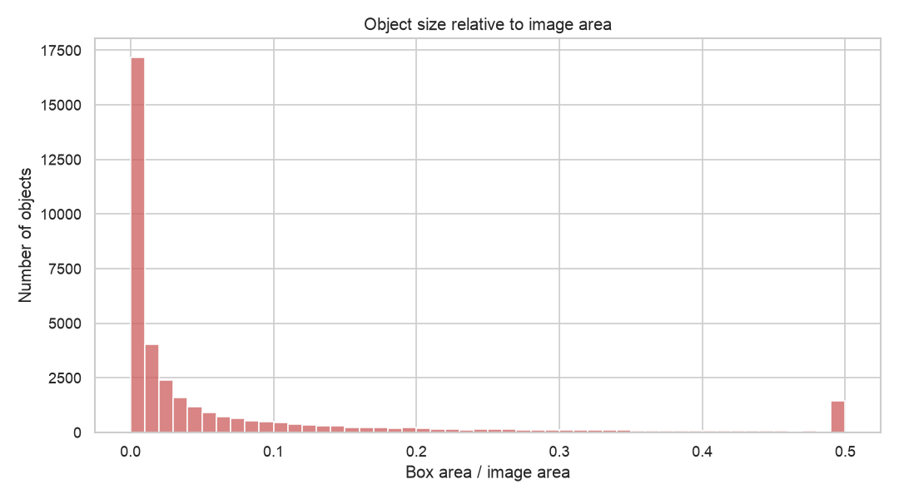
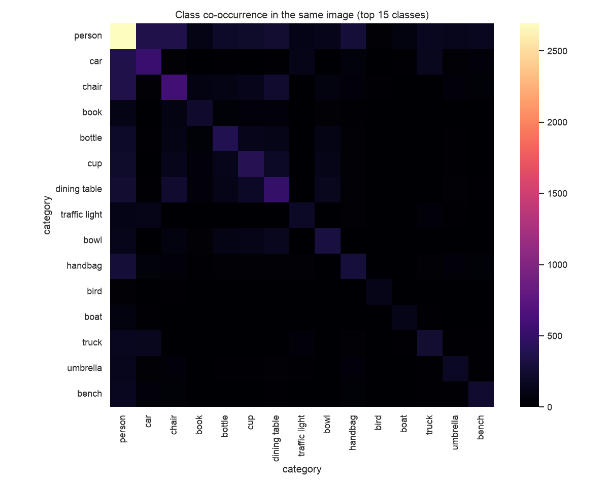

# Exploratory Data Analysis — COCO val2017

This report examines the data — number of observations, number and type of features, statistical dependencies, and anomalies — with visualizations and commentary.

All numbers below are produced by `uv run python -m objdetect.eda.report`, which calls the tested functions in the `eda` package. Figures are in `research/figures/`. The interactive version is `research/01_eda.ipynb`.

## 1. What is an observation, and what are the features?

The split analysed is **COCO 2017 validation**: **4 952 images** carrying **36 781 annotations** across the **80** COCO classes.

The natural unit of observation is one **annotation** — a single labelled bounding box. Each one has these features:

| Feature | Type | Meaning |
|---------|------|---------|
| `image_id` | categorical | which image the box belongs to |
| `category`, `supercategory` | categorical | class and its group (e.g. dog → animal) |
| `x, y, width, height` | numeric | box position and size, in pixels |
| `area`, `relative_area` | numeric | box area, absolute and as a fraction of the image |
| `aspect_ratio` | numeric | width / height |
| `iscrowd` | boolean | whether the box marks a *group* of objects, not one |
| `image_width`, `image_height` | numeric | size of the parent image |

## 2. Class distribution — strong imbalance

The dataset is **severely imbalanced**. `person` is by far the most common class with **11 004 instances**, while the rarest, `toaster`, has just **9** — an imbalance ratio of roughly **1 200:1**. A handful of classes (person, car, chair) account for a large share of all boxes.

**Why it matters:** rare classes get little gradient signal and are detected worse. It also motivates the project's fine-tuning **subset of ten common everyday classes** (person, bicycle, car, dog, cat, chair, bottle, cup, laptop, cell phone) — frequent enough to learn from within the compute budget.

## 3. Scene density — objects per image

Images contain a **mean of 7.4** and **median of 4** objects, but the distribution has a long tail reaching **63 objects** in a single image. This is the "in Context" part of COCO: cluttered, realistic scenes rather than single centered objects.

**Why it matters:** crowded scenes are where Non-Maximum Suppression and small-object handling are stressed — exactly where two-stage detectors tend to beat one-stage ones.

## 4. Object scale — many small objects

**46.7%** of all objects occupy **less than 1%** of their image's area. Small objects dominate.

**Why it matters:** small-object detection is the hardest regime and the reason the Faster R-CNN model here uses a **Feature Pyramid Network**. It also sets expectations: mAP on this data is limited mostly by the small objects.

## 5. Statistical dependencies — class co-occurrence

Classes are **not independent**. The co-occurrence heatmap over the 15 most frequent classes shows strong off-diagonal structure: `person` co-occurs with almost everything, and kitchen/table items (`cup`, `fork`, `bowl`, `dining table`) cluster together. This is genuine contextual dependency, not chance.

**Why it matters:** context is a real signal a detector can exploit, and it explains why "Common Objects in **Context**" is a harder, more realistic benchmark than isolated-object datasets.

## 6. Anomalies

Scanning the annotations (`eda.find_anomalies`) surfaces entries that need care:

| Anomaly | Count | What it is |
|---------|-------|-----------|
| `crowd` | 446 | `iscrowd` boxes covering a *group* of objects, not one instance |
| `tiny` | 149 | boxes under 16 px² — near-impossible to detect, often label noise |
| `extreme_aspect` | 145 | aspect ratio beyond 10:1 — usually occluded slivers |

(No out-of-bounds boxes were found in this split.)

**How the project handles them:** `CocoSubsetDataset` **drops `iscrowd` and degenerate (≤1 px) boxes** during training, because a crowd box would teach the box regressor wrong geometry and tiny boxes contribute unstable loss. This is a direct, defensible link from the EDA to a modelling decision.

## 7. Summary

COCO val2017 is a realistic, **imbalanced**, **cluttered**, **small-object-heavy** detection benchmark with meaningful **contextual dependencies** between classes and a minority of **anomalous annotations** that the data pipeline filters. These properties justify the project's choices: a curated class subset, an FPN-based two-stage model compared against a fast one-stage model, and explicit cleaning of crowd and degenerate boxes.
